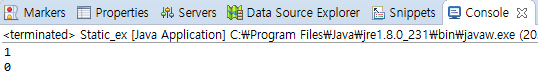
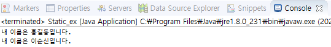

# 객체지향

> 제품을 만들 때 부품을 개발하고 이 부품을 하나씩 조립해서 완성된 것을 만들 듯이
>
> 소프트웨어를 개발할 때도 객체를 만들고 객체 하나하나를 조립해서 완성하는 프로그래밍을
>
> 객체지향 프로그래밍(Object-Oriented-Programming)이라 한다.

* 객체란 어떤 것의 물리적이나 추상적으로 식별 가능한 속성을 의미한다.

  * 소프트웨어 세계에 구현할 대상

  예를들어, 사람의 이름, 나이, 성별, 키 / 자동차의 색상, 모델명, 크기

## 클래스

> 클래스는 설계도와 같다.

#### 클래스 선언

```java
public class 클래스이름 {
  
}
```

#### 객체 생성

```java
new 클래스();

//클래스 변수 선언을 하고 객체를 생성하는 문장
클래스 변수;
변수 = new 클래스();

//클래스 변수 선언과 객체 생성을 한 개의 실행문으로 작성
클래스 변수 = new 클래스();
```


#### 클래스의 구성 멤버

```java
public class ClassName {
  //필드 : 객체의 데이커가 저장되는 곳
  int fieldName;
  
  //생성자 : 객체 생성 시 초기화 역할 담당
  ClassName(){ ... }
  
  //메소드 : 객체의 동작에 해당하는 실행 블록
  void methodName() { ... }
}
```


## 인스턴스

> 설계도(클래스)를 바탕으로 소프트웨어 세계에 구현된 구체적인 실체를 인스턴스라 한다.
>
> 실체화된 인스턴스는 메모리에 할당된다.

```java
/* 클래스 */
public class Animal {
  ...
}
/* 객체와 인스턴스 */
public class Main {
  public static void main(String[] args) {
    Animal cat, dog; // '객체'

    // 인스턴스화
    cat = new Animal(); // cat은 Animal 클래스의 '인스턴스'(객체를 메모리에 할당)
    dog = new Animal(); // dog은 Animal 클래스의 '인스턴스'(객체를 메모리에 할당)
  }
}

// 참조 : https://gmlwjd9405.github.io/2018/09/17/class-object-instance.html
```


## static

> 고정된이란 의미를 가지고 있으며 정적 멤버는 클래스에 고정된 멤버로서 객체를 생성하지 않고 사용할 수 있는 필드와 메소드를 말한다 .

* 정적 필드와 정적 메소드는 객체에 소속된 멤버가 아니라 클래스에 고정된 멤버이다.
  * 그렇기에 정적 멤버는 힙(Heap) 영역에 메모리를 공유하지 않고 static 메모리에 공유한다. 

#### 정적 멤버 선언

```java
public class 클래스{
  //정적 필드
  static 타입 필드 [= 초기값];
  
  //정적 메소드
  static 리턴 타입 메소드(매개변수선업, ...) { ... }
}
```

*

### 예시 코드

#### 정적 필드

```java
class Number{
    static int num = 0; //클래스 필드
    int num2 = 0; //인스턴스 필드
}

public class Static_ex {
	
    public static void main(String[] args) {
    	Number number1 = new Number(); //첫번째 number
    	Number number2 = new Number(); //두번쨰 number
    	
    	number1.num++; //클래스 필드 num을 1증가시킴
    	number1.num2++; //인스턴스 필드 num을 1증가시킴
    	System.out.println(number2.num); //두번째 number의 클래스 필드 출력
    	System.out.println(number2.num2); //두번째 number의 인스턴스 필드 출력
    }
}
```

결과창



#### 정적 메소드

```java
class Name{
    static void print() { //클래스 메소드
	System.out.println("내 이름은 홍길동입니다.");
    }

    void print2() { //인스턴스 메소드
	System.out.println("내 이름은 이순신입니다.");
    }
}

public class Static_ex {
	
    public static void main(String[] args) {
        Name.print(); //인스턴스를 생성하지 않아도 호출이 가능
    	
        Name name = new Name(); //인스턴스 생성
        name.print2(); //인스턴스를 생성하여야만 호출이 가능
    }
}
```

결과창




## 생성자

> 생성자는 new 연산자와 같이 사영되어 클래스로부터 생성할 때 호술되어 객체의 초기화를 담당


#### 생성자 선언

```java
//생성자 블록
클래스 (매개변수선언, ...) {
  //객체의 초기화 코드
}
```

### 예시 코드

```java
//Car.java 생성자 선언
public class Car {
  //셍성자
  Car(String color, int cc) {
  }
}
```

```java
//CarExample.java 생성자를 호출해서 객체 생성
public class CarExample {
  public static void main(String[] args) {
    Car myCar = mew Car ("검정", 3000);
    //Car myCar = new Car(); (x) 기본 생성자를 호출할 수 없다.
  }
}
```

* 클래스로부터 객체가 생성될 때 필드는 기본 초기값으로 자동 설정된다. 
  * 만약, 다른 값으로 초기화를 하고 싶다면 두가지 방법이 있다
  * 하나는 필드를 선언할 때 초기값을 주는 방법
  * 또 다른 하나는 생성자에서 초기값을 주는 방법

#### 생성자 오버로딩

* 매개 변수를 달리하는 생성자를 여러 개 선언하는 것을 말한다.

```java
public class 클래스 {
  클래스 ([타입 매개변수, ...]) { // [] 부분이 생성자의 오버로딩  
    ...
  }
	클래스 ([타입 매개변수, ...]) { // [] 부분이 생성자의 오버로딩  
    ...
  }
}
```


예시 코드 

```java
public class car {
  car(){ ... } //생성자 오버로딩 예시 1
  car(String model) { ... } //생성자 오버로딩 예시 2
  car(String model, String color) { ... } //생성자 오버로딩 예시 3
  car(String model, String color. int maxSpeed) { ... } //생성자 오버로딩 예시 4
  
}
```


#### this() 다른 생성자 호출

* 생성자 오버로딩이 많아질 경우 생성자 간의 중복된 코드가 발생할 수 있다. 

  이 경우, 필드 초기화 내용은 한 생성자에만 집중저그로 작성하고 나머지 생성자는 초기화 내용을 가지고 있는 생성자를 호출하는 방법을 개선 가능

```java
클래스( [매개변수선언, ... ]){
  this(매개변수, ..., 값, ...); //클래스의 다른 생성자 호출
  실행문;
}
```

예시코드

```java
public class Car {
  //필드
  String compay = "포르쉐";
  String model;
  String color;
  int maxSpeed;
  
  //생성자
  Car(){  
  }
  
  Car(String model){  //호출
  this(model, "은색", 250);
	}
  
  Car(String model, String color)){ //호출
  this(model, color, 250);
	}
  
  Car(String model, String color, int maxSpeed)){//앞 생성자의 콩통 실행 코드
  this.model = model;
  this.color =  color;
  this.maxSpeed = maxSpeed;
	}
}

```


## 패키지

> 클래스를 체계적으로 관리하기 위해 패키지르 사용

```java
package 상위패키지.하위패키지;

public class ClassName { ... }
```


### import문

* 패키지 이름이 길거나 사용해야할 클래스 수가 많다면 import문을 사용

```java
package com.mtcompany;

import com.hankook.Tire;
//또는 com.hankook.*; 으로 hankook에 모든 클래스 사용 선언
```

